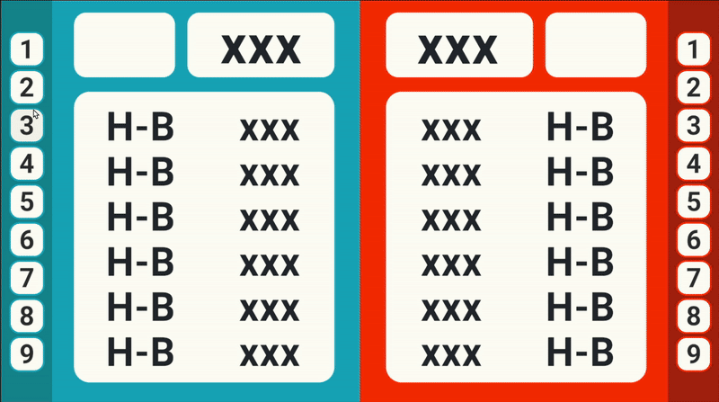

# Hit-BlowAI

制作日:2024.1  
AI演習課題作品  

---

## はじめに
AIに関するものを作るという課題で制作したものです。
今日のさまざまなゲームには、「Bot」と呼ばれるAIが対戦相手として登場します。これらのBotは単なる自動操作ではなく、人間の思考アルゴリズムを模倣して設計されたAIの一種です。私はその構造に強い興味を持ち、「自分でも考えるAIをつくって対戦してみたい」と思い制作しました。

当時夢中になっていたヒットアンドブローという数字当てゲームを題材に、独自のAI Botを制作することにしました。
このBotは、ルールに基づいて仮説を立て、結果に応じて情報を絞り込んでいくことで、人間のように推論しながら正解を導き出す仕組みになっています。

[プレイ映像](https://youtu.be/03C6ezi362A)

人間の思考プロセスをどのようにロジックとして再現するか、という問いに向き合いながらアルゴリズムを組み立てる過程は非常に刺激的で、AIの根本にある「知性の構築」に触れる貴重な経験となりました。

---

## 🤖予想アルゴリズム
今作でのヒットアンドブローは1-9の数字３桁、重複なしです。（ヒットアンドブロー自体のルールは省略します。）

制作にあたってまず自分の予想の仕方を考えました。

### ヒットだった場合
推測した数字が「位置（桁）」も「値」も正しかったことを意味します。
つまり、その数字はその位置にしか存在しないことが確定するので、他の位置に同じ数字がある可能性はなくなります。

### ブローだった場合
推測した数字は正解に含まれているが、位置（桁）が違っていたという意味です。
つまり、その数字は今の位置には存在しないが、他のどこかにはあるということが分かります。
したがって、今の位置でその数字が正解である可能性は排除できます

このようにして返ってきた結果を元に可能性を排除して次の予想していることがわかり、この予想アルゴリズムをプログラムすれば自分と同じ予想の仕方をするAIと対戦できると思いました。
([AIguessSystem](Assets/Scripts/AIGuessSystem.cs))

---

## 🚀遊び方
※プレイするにあたっては必ず注意事項を読んだ上でプレイしてください。  
初回のターンは自分の3桁の数字を決めます。左の数字ボタンを押して決めてください。

  

次のターン以降は相手の数字を当てるターンとなります。予想する数字をボタンを押して決めてください。  

  

---

## ⚠️注意事項
-  この作品はあくまでAIを体験する名目で制作した作品のため、ゲーム性は低いです。
-  ゲーム中に案内等はありません。
-  3Hになってもゲームが終了したり、次のゲームが始まったりなどはしません。

以上をご了承ください。

---

## 最後に
このAIの予想アルゴリズムは最効率とは言えません（現にこの方法より可能性を絞ることだけにフォーカスした方法の方がより早い手で当てれる）。しかし、この課題で自分と同じ予想
アルゴリズムに則って予想を行うAIと対戦できたことに感動を覚えました。
